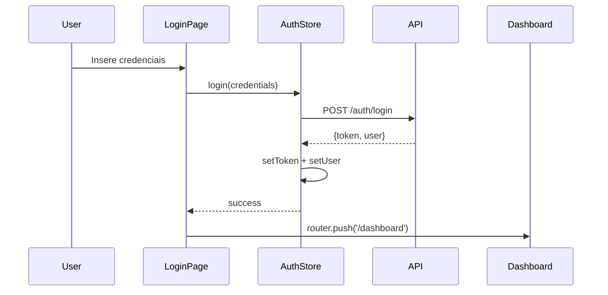

# 🧠 SmartPicks - Plataforma de Apostas Inteligentes

> Sistema moderno de palpites e apostas construído com Vue 3, Quasar Framework e TypeScript

[](https://quasar.dev/)
[](https://vuejs.org/)
[](https://www.typescriptlang.org/)
[](https://pinia.vuejs.org/)

## 📋 Índice

- [Sobre o Projeto](#-sobre-o-projeto)
- [Padrões e Arquitetura](#-padrões-e-arquitetura)
- [Instalação e Setup](#-instalação-e-setup)
- [Desenvolvimento](#-desenvolvimento)
- [Estrutura do Projeto](#-estrutura-do-projeto)
- [Documentação](#-documentação)
- [Deploy e CI/CD](#-deploy-e-cicd)
- [Troubleshooting](#-troubleshooting)

## 🎯 Sobre o Projeto

SmartPicks é uma plataforma completa para criação e compartilhamento de palpites de apostas, oferecendo:

- **Sistema de Autenticação** completo com JWT
- **Upload de Imagens** para palpites com preview
- **Interface Responsiva** para desktop e mobile
- **Dashboard Administrativo** para gestão
- **API RESTful** integrada com backend Go
- **Deploy Automatizado** com GitHub Actions

### 🛠️ Stack Tecnológica

**Frontend:**

- Vue 3 (Composition API) + TypeScript
- Quasar Framework v2.18.5 (UI Components)
- Pinia (State Management)
- Vue Router (Routing + Guards)
- Axios (HTTP Client)
- SCSS (Styling)

**Backend:**

- Go + Gin Framework
- PostgreSQL (Neon)
- JWT Authentication
- File Upload
- Vercel Deployment

**DevOps:**

- Firebase Hosting (Frontend)
- Vercel (Backend)
- GitHub Actions (CI/CD)
- ESLint + Prettier (Code Quality)

## �️ Padrões e Arquitetura

### Padrões de Desenvolvimento Implementados

- **Composition API First**: Vue 3 com `<script setup>` e TypeScript
- **Design System**: Sistema de cores, espaçamentos e componentes padronizados
- **Utility Classes**: Classes utilitárias para layouts e estilização
- **TypeScript Strict**: Tipagem rigorosa em todo o projeto
- **Code Quality**: ESLint + Prettier + EditorConfig
- **Semantic Commit**: Convenções de commit padronizadas
- **Component Architecture**: Componentes reutilizáveis e bem estruturados

### Arquitetura da Aplicação

```
┌─────────────────────────────────────┐
│         Pages (Views)                │
│  LoginPage, Dashboard, AdminPanel    │
└─────────────────────────────────────┘
                 ↓
┌─────────────────────────────────────┐
│       Components (UI)                │
│  AppHeader, ModalPalpite, UserAvatar │
└─────────────────────────────────────┘
                 ↓
┌─────────────────────────────────────┐
│      Composables (Logic)             │
│  useApi, useNotifications, useAuth   │
└─────────────────────────────────────┘
                 ↓
┌─────────────────────────────────────┐
│      Store (Pinia)                   │
│  Estado global + persistência        │
└─────────────────────────────────────┘
                 ↓
┌─────────────────────────────────────┐
│      API Layer (Axios)               │
│  Interceptors + Error Handling       │
└─────────────────────────────────────┘
```

### Fluxo de Autenticação



### Sistema de Rotas e Guards

- **initializeAuth**: Valida token existente no localStorage
- **requireAuth**: Protege rotas que precisam de autenticação
- **requireGuest**: Redireciona usuários logados (login/cadastro)
- **adminOnly**: Acesso exclusivo para administradores

## 🚀 Instalação e Setup

### Pré-requisitos

- Node.js >= 18.x
- npm >= 9.x ou yarn >= 1.22

### Passo a Passo

```bash
# 1. Clone o repositório
git clone https://github.com/AdrianResende/smartPicks.git
cd smartPicks/FrontEnd/smartPicks

# 2. Instale as dependências
npm install

# 3. Configure variáveis de ambiente (se necessário)
# Edite src/boot/axios.ts para alterar baseURL da API

# 4. Inicie o servidor de desenvolvimento
npm run dev
```

A aplicação estará disponível em `http://localhost:9000`

## 📦 Comandos Úteis

### Desenvolvimento

```bash
# Iniciar servidor de desenvolvimento
npm run dev
# ou
quasar dev

# Rodar em modo PWA
quasar dev -m pwa

# Rodar em modo Electron
quasar dev -m electron
```

### Qualidade de Código

```bash
# Executar linter
npm run lint

# Executar linter e corrigir automaticamente
npm run lint -- --fix

# Formatar código
npm run format
```

### Build

```bash
# Build para produção (SPA)
npm run build
# ou
quasar build

# Build para PWA
quasar build -m pwa

# Build para Electron
quasar build -m electron
```

### Utilitários

```bash
# Limpar cache e node_modules
npx quasar clean

# Informações sobre Quasar
quasar info

# Criar componente
quasar new component NomeDoComponente

# Criar página
quasar new page NomeDaPagina
```

## 📁 Estrutura do Projeto

```
smartpicks-frontend/
├── 📁 public/                 # Arquivos estáticos
│   ├── favicon.ico
│   └── icons/                 # Logos e ícones da aplicação
├── 📁 src/
│   ├── 📁 boot/               # Inicialização Quasar
│   │   ├── axios.ts           # Cliente HTTP + interceptors
│   │   ├── icons.ts           # Ícones do projeto
│   │   └── toastify.ts        # Sistema de notificações
│   ├── 📁 components/         # Componentes reutilizáveis
│   │   ├── AppHeader.vue      # Header com navegação
│   │   ├── ModalPalpite.vue   # Modal criação de palpites
│   │   └── UserAvatar.vue     # Avatar do usuário
│   ├── 📁 composables/        # Lógica reutilizável
│   │   ├── useApi.ts          # HTTP client abstraction
│   │   └── useNotifications.ts # Sistema de notificações
│   ├── 📁 constants/          # Constantes da aplicação
│   │   └── index.ts           # URLs, configs, enums
│   ├── 📁 css/                # Estilos e design system
│   │   ├── app.scss           # Estilos base + utilitários
│   │   ├── utilities.scss     # Classes utilitárias
│   │   └── quasar.variables.scss # Design tokens
│   ├── 📁 pages/              # Páginas/Views da aplicação
│   │   ├── LoginPage.vue      # Autenticação
│   │   ├── CadastroPage.vue   # Registro de usuários
│   │   ├── DashboardPage.vue  # Dashboard principal
│   │   ├── AdminDashboard.vue # Painel administrativo
│   │   ├── AcessoNegado.vue   # Página de acesso negado
│   │   └── ErrorNotFound.vue  # Página 404
│   ├── 📁 router/             # Sistema de roteamento
│   │   ├── index.ts           # Configuração Vue Router
│   │   ├── routes.ts          # Definição das rotas
│   │   └── guards.ts          # Guards de autenticação
│   ├── 📁 stores/             # Estado global (Pinia)
│   │   ├── index.ts           # Configuração Pinia
│   │   └── auth.ts            # Store de autenticação
│   ├── 📁 types/              # Definições TypeScript
│   │   └── index.ts           # Interfaces e tipos
│   ├── 📁 utils/              # Utilitários
│   │   ├── sanitization.ts    # Sanitização de dados
│   │   └── validation.ts      # Validações de formulário
│   ├── App.vue                # Componente raiz
│   └── env.d.ts               # Declarações TypeScript
├── 📄 .editorconfig           # Configuração editor
├── 📄 .prettierrc.json        # Formatação de código
├── 📄 eslint.config.js        # Linting e qualidade
├── 📄 quasar.config.ts        # Configuração Quasar
├── 📄 tsconfig.json           # Configuração TypeScript
├── 📄 STYLE-GUIDE.md          # Guia de estilos frontend
└── 📄 BACKEND-STANDARDS.md    # Padrões do backend
```

## � Desenvolvimento

### Scripts Disponíveis

```bash
# Desenvolvimento com hot-reload
npm run dev

# Build para produção
npm run build

# Preview da build de produção
npm run preview

# Linting e correção
npm run lint
npm run lint:fix

# Type checking
npm run type-check
```

### Padrões de Desenvolvimento

#### Componentes Vue

```vue
<!-- Padrão: Composition API + TypeScript -->
<template>
  <div class="meu-componente">
    <q-card class="elevation-2">
      <q-card-section>
        <h6 class="text-h6 text-primary">{{ titulo }}</h6>
      </q-card-section>
    </q-card>
  </div>
</template>

<script setup lang="ts">
// Interfaces locais
interface Props {
  titulo: string;
  opcional?: boolean;
}

// Props tipadas
const props = withDefaults(defineProps<Props>(), {
  opcional: false,
});

// Emits tipados
const emit = defineEmits<{
  click: [id: string];
  update: [value: any];
}>();

// Estado reativo
const loading = ref(false);

// Computadas
const cssClasses = computed(() => ({
  'is-loading': loading.value,
}));

// Métodos
const handleClick = () => {
  emit('click', 'exemplo');
};
</script>

<style lang="scss" scoped>
.meu-componente {
  // Use variáveis do design system
  padding: $spacing-md;
  border-radius: $border-radius-md;
}
</style>
```

#### Páginas

```vue
<template>
  <q-page class="page-container">
    <app-header titulo="Minha Página" />

    <div class="content-area">
      <!-- Conteúdo -->
    </div>
  </q-page>
</template>

<script setup lang="ts">
import { ref, onMounted } from 'vue';
import { useNotifications } from 'src/composables/useNotifications';

// Composables
const { showSuccess, showError } = useNotifications();

// Estado
const dados = ref([]);

// Lifecycle
onMounted(async () => {
  await carregarDados();
});

// Actions
const carregarDados = async () => {
  try {
    // lógica
    showSuccess('Sucesso!');
  } catch (error) {
    showError('Erro!');
  }
};
</script>
```

### Adicionando um Guard

Em `src/router/guards.ts`:

```typescript
export const meuGuard: NavigationGuard = async (to, from, next) => {
  // Sua lógica aqui
  if (condicao) {
    next();
  } else {
    next({ name: 'login' });
  }
};
```

Registre em `src/router/index.ts`:

```typescript
router.beforeEach(meuGuard);
```

### Usando a Store de Auth

```typescript
import { useAuthStore } from 'src/stores/auth';

const authStore = useAuthStore();

// Verificar autenticação
if (authStore.isAuthenticated) {
  // Usuário logado
}

// Verificar se é admin
if (authStore.isAdmin) {
  // Usuário é admin
}

// Fazer login
await authStore.login(email, senha);

// Fazer logout
await authStore.logout();

// Validar token
const isValid = await authStore.validateToken();
```

### Exibindo Notificações

```typescript
import { toast } from 'vue3-toastify';

// Sucesso
toast.success('Operação realizada com sucesso!');

// Erro
toast.error('Ocorreu um erro!');

// Info
toast.info('Informação importante');

// Warning
toast.warning('Atenção!');
```

### Usando Classes do Quasar

```vue
<template>
  <!-- Layout Flex -->
  <div class="flex flex-center q-pa-md">
    <!-- Texto -->
    <h1 class="text-h4 text-weight-bold text-primary q-mb-md">Título</h1>

    <!-- Espaçamento -->
    <div class="q-mt-lg q-px-md">
      <!-- Cores -->
      <p class="text-grey-7 bg-grey-1 q-pa-sm">Conteúdo</p>
    </div>

    <!-- Grid Responsivo -->
    <div class="row q-col-gutter-md">
      <div class="col-12 col-md-6">Coluna 1</div>
      <div class="col-12 col-md-6">Coluna 2</div>
    </div>
  </div>
</template>
```

## 🔐 Autenticação

### Fluxo de Token

A aplicação suporta **dois métodos de autenticação**:

1. **Bearer Token** (localStorage):
   - Token salvo após login
   - Enviado no header `Authorization: Bearer {token}`
   - Usado para validação de rotas

2. **Session Cookie**:
   - Cookie httpOnly definido pelo backend
   - Axios configurado com `withCredentials: true`
   - Usado como fallback se token não existir

### Estrutura da Store Auth

```typescript
interface User {
  id: string;
  nome: string;
  email: string;
  perfil: string; // 'administrador' | 'comum'
}

interface AuthState {
  user: User | null;
  token: string | null;
}
```

### Guards Implementados

- **`initializeAuth`**: Valida token no load inicial
- **`requireAuth`**: Protege rotas que precisam de login
- **`requireGuest`**: Redireciona usuários logados (login/cadastro)

### Endpoints de Auth

```typescript
// Login
POST /auth/login
Body: { email: string, senha: string }
Response: { token: string, nome: string, email: string, perfil: string }

// Validar Token
POST /auth/validate
Headers: { Authorization: Bearer {token} }
Response: { valido: boolean, usuario: User }

// Verificar Permissões (fallback cookie)
POST /auth/checkUserPermissions
Response: { nome: string, email: string, perfil: string }
```

## 🎨 Componentes Principais

### Header.vue

Header condicional que aparece apenas quando usuário está autenticado:

- Logo SmartPicks (link para dashboard)
- Badge de perfil (Admin/Usuário)
- Email do usuário
- Botão de logout

### LoginPage.vue

- Formulário de login com validação
- Email e senha obrigatórios
- Link para cadastro
- Toast notifications para feedback
- Redirecionamento após login bem-sucedido

### CadastroPage.vue

- Formulário completo de cadastro
- Validações frontend
- Exibição de erros do backend em toast
- Redirecionamento para login após sucesso

### DashboardPage.vue

- Página inicial após login
- Mensagem de boas-vindas personalizada
- Ícone do SmartPicks
- Indicador de perfil (Admin/Usuário)
- Design minimalista com Quasar utilities

## � Documentação

### Documentos de Referência

- **[STYLE-GUIDE.md](./STYLE-GUIDE.md)**: Padrões de código e convenções
- **[BACKEND-STANDARDS.md](./BACKEND-STANDARDS.md)**: Padrões para API Go
- **[BRANCH-WORKFLOW.md](./BRANCH-WORKFLOW.md)**: Fluxo de trabalho Git

### Arquivos de Configuração

- **`.editorconfig`**: Formatação consistente entre editores
- **`.prettierrc.json`**: Formatação automática de código
- **`eslint.config.js`**: Regras de linting para qualidade
- **`tsconfig.json`**: Configuração TypeScript strict

### Design System

O projeto utiliza um design system baseado no Quasar com:

- **Cores**: Sistema de cores semânticas e neutras
- **Espaçamentos**: Escala harmônica de espaçamentos
- **Tipografia**: Hierarquia tipográfica consistente
- **Componentes**: Componentes padronizados e reutilizáveis
- **Utilitários**: Classes CSS para layouts e estilização

## 🚀 Deploy e CI/CD

### Deploy Frontend (Firebase)

```bash
# Build para produção
npm run build

# Deploy para Firebase
npm run deploy
```

### Deploy Backend (Vercel)

O backend Go é automaticamente deployado no Vercel através de:

- **Push para main**: Deploy automático
- **Pull Requests**: Deploy de preview
- **Environment Variables**: Configuradas no dashboard Vercel

### GitHub Actions

O projeto utiliza workflows automatizados para:

- **Lint e Type Check**: Validação de código
- **Build Testing**: Teste de builds
- **Deploy Staging**: Deploy automático para staging
- **Deploy Production**: Deploy manual para produção

## 🐛 Troubleshooting

### Problemas Comuns

#### 1. Token JWT Inválido

```bash
# Limpar localStorage
localStorage.clear()

# Verificar validade do token
console.log(jwt_decode(token))
```

#### 2. CORS Issues

Verificar configuração axios em `src/boot/axios.ts`:

```typescript
api.defaults.withCredentials = true;
api.defaults.baseURL = 'https://sua-api.vercel.app';
```

#### 3. Build Failures

```bash
# Limpar cache
npm run clean
rm -rf node_modules
npm install

# Type check
npm run type-check
```

#### 4. Quasar Components não funcionam

Verificar se os componentes estão registrados em `quasar.config.ts`:

```typescript
framework: {
  components: ['QBtn', 'QInput', 'QCard']
}
}
```

### Problema: Build falha com erros de lint

**Solução**: Executar lint antes do build:

```bash
npm run lint -- --fix
npm run build
```

### Problema: Componente não atualiza após mudança no store

**Solução**: Usar computed para reatividade:

```typescript
import { computed } from 'vue';

const isAdmin = computed(() => authStore.isAdmin);
```

### Problema: Erro de CORS

**Solução**: Backend deve configurar CORS corretamente e frontend usar `withCredentials`:

```typescript
// boot/axios.ts
api.defaults.withCredentials = true;
```

## 📝 Boas Práticas

### TypeScript

- ✅ Sempre tipar props e emits
- ✅ Usar interfaces para objetos complexos
- ✅ Evitar `any`, preferir `unknown`
- ✅ Usar strict mode

### Vue/Quasar

- ✅ Preferir Composition API
- ✅ Usar classes do Quasar em vez de CSS customizado
- ✅ Componentizar código reutilizável
- ✅ Usar `computed` para valores derivados
- ✅ Usar `ref` para valores reativos simples

### Estado

- ✅ Stores Pinia para estado global
- ✅ `ref`/`reactive` para estado local
- ✅ Evitar mutação direta do estado
- ✅ Actions para lógica assíncrona

### Segurança

- ✅ Sanitizar inputs do usuário
- ✅ Validar dados no frontend E backend
- ✅ Não expor tokens em logs
- ✅ Usar HTTPS em produção
- ✅ Implementar rate limiting

## 🤝 Contribuindo

1. Fork o projeto
2. Crie uma branch para sua feature (`git checkout -b feature/MinhaFeature`)
3. Commit suas mudanças (`git commit -m 'Adiciona MinhaFeature'`)
4. Push para a branch (`git push origin feature/MinhaFeature`)
5. Abra um Pull Request

### Padrão de Commits

```
feat: adiciona nova funcionalidade
fix: corrige bug
docs: atualiza documentação
style: formatação de código
refactor: refatoração sem alterar funcionalidade
test: adiciona ou corrige testes
chore: tarefas de manutenção
```

---

## 🤝 Contribuindo

### Como Contribuir

1. **Fork** o repositório
2. **Crie** uma branch para sua feature: `git checkout -b feature/nova-feature`
3. **Commit** suas mudanças: `git commit -m 'feat: adiciona nova feature'`
4. **Push** para a branch: `git push origin feature/nova-feature`
5. **Abra** um Pull Request

### Convenções de Commit

Utilizamos [Conventional Commits](https://www.conventionalcommits.org/):

```bash
feat: nova funcionalidade
fix: correção de bug
docs: atualização de documentação
style: formatação, missing semi colons, etc
refactor: refatoração de código
test: adição de testes
chore: atualização de build, deps, etc
```

### Code Review

- ✅ Código segue os padrões estabelecidos
- ✅ Testes passam (se aplicável)
- ✅ Documentação atualizada
- ✅ Performance não foi impactada
- ✅ Acessibilidade mantida

---

## 📞 Suporte

### Links Úteis

- [Documentação Vue 3](https://vuejs.org/guide/)
- [Documentação Quasar](https://quasar.dev/docs)
- [TypeScript Handbook](https://www.typescriptlang.org/docs/)
- [Pinia Documentation](https://pinia.vuejs.org/)

### Contato

- **Desenvolvedor**: Adrian Resende
- **GitHub**: [@AdrianResende](https://github.com/AdrianResende)

---

## 📄 Licença

Este projeto está sob a licença [MIT](LICENSE).

---

<div align="center">
  <p>
    Feito com ❤️ e ☕ por 
    <a href="https://github.com/AdrianResende">Adrian Resende</a>
  </p>
  
  <p>
    <strong>SmartPicks</strong> - Apostas Inteligentes 🧠⚽
  </p>
</div>
